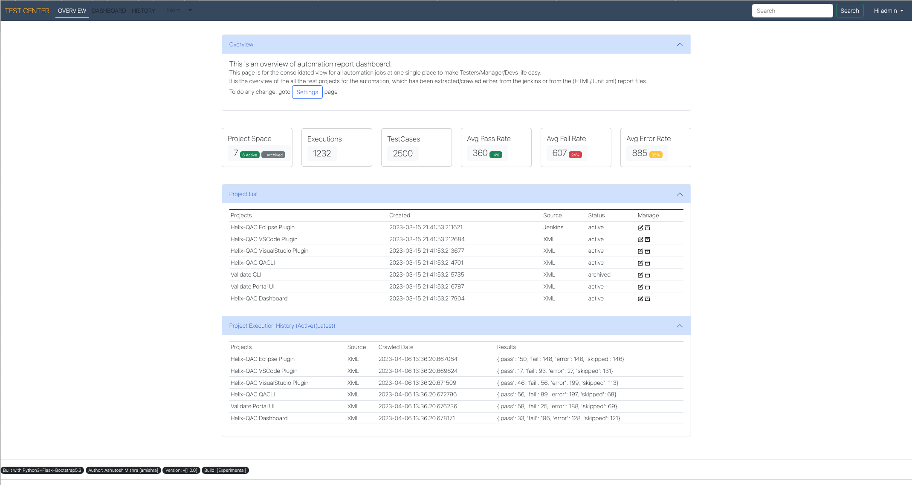
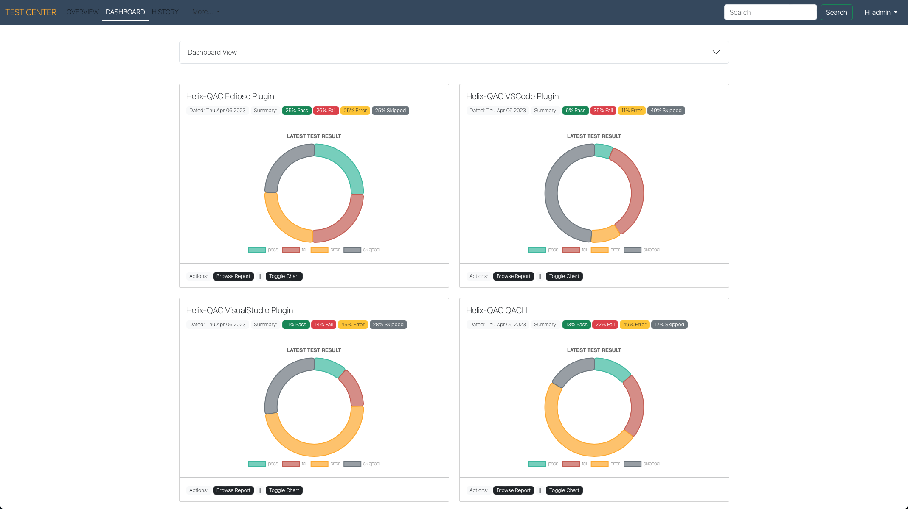
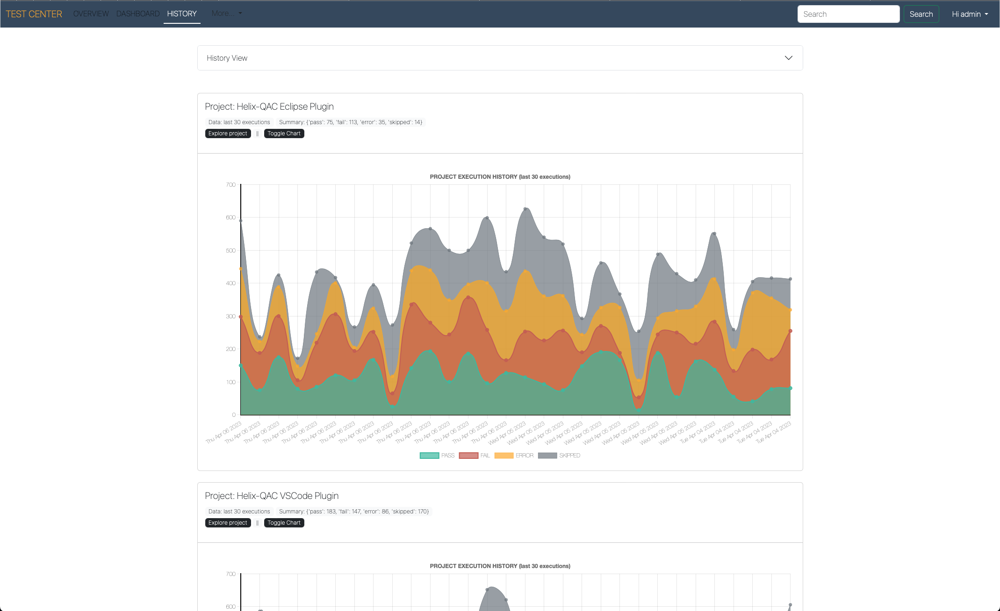

### Reporting Dashboard v2.0

###### Screenshots
1- Overview page

2- Dashboard page

3- Hostory page

###### Description
It is the combination of few services which gets/crawls the reports and manage the report on the disk as well as in to the database; it keeps cleaning the old records and keeps last 20-30(as configured) records.
<pre>
# Application Structure
# ==========================
# ReportDashboard
#               \____ app                           # This is the application source dir
#                   |____ client
#                       |____ static                # This contains all the static sources like: js, css
#                       |____ templates             # This contains all the HTML source files
#
#                   |____ server
#                       |____ entire source code lies here # This has all the python3 back-end server logic
#                       |____ config
#                               |________ # This contains all configurations (app, db, etc)
#                       |____ crawlers
#                       |____ dbase
#                       |____ routes
#                       |____ unittests
#                       |____ utilities
#                       |____ views
#
#                   |____ __init__.py
#                   |____ settings.py               
#
#               |____ LICENSE
#               |____ main.py                       # This is the entry point; starts the server
#               |____ pytest.ini                    # This is pytest configuration for testing server
#               |____ README.md                     # Refer this file for more details of HowTo
#               |____ requirements.txt              # Python packages requirement file
#

</pre>

###### There are three section of this application
1. Crawler
2. Reports data Manager
3. Dashboard Server

###### Setup
Just clone the repo/code and install the requirements;
> `python3 -m pip install requirements.txt`

###### Application Usage
> Usage
>
> `python3 main.py`

> Usage to start a crawling:
> 
> `python3 main.py --debug-mode --crawl=crawl_directory`
 
> Server Usage:
> 
> `python3 main.py --debug-mode --start-server --port=port_no`

> Separate Usage:
> 
> `python3 crawler.py --crawl=crawl_directory --verbose`
> 
> `python3 server.py --port=port_no --verbose`

<!-- Do not Edit below this line -->

###### Other things
Simply goes here

###### Template Rendering args
1st arg: template file  
2nd arg: username in session   
3rd arg: ui_config   
4th arg: data (related to projects and all)     
<pre> 
Syntax:
render_template("index.html",
                  page_name="",
                  username=session['user'], 
                  ui_configuration=app_ui_config, 
                  data=sample_data.latest_data)
Example:
render_template(ui_config["/index"]["template_name"],
                page_name = ui_config["/index"]["page_name"],
                username = ,
                ui_configuration = ,
                data
                )
</pre>

Developer: nityanarayan44@live.com